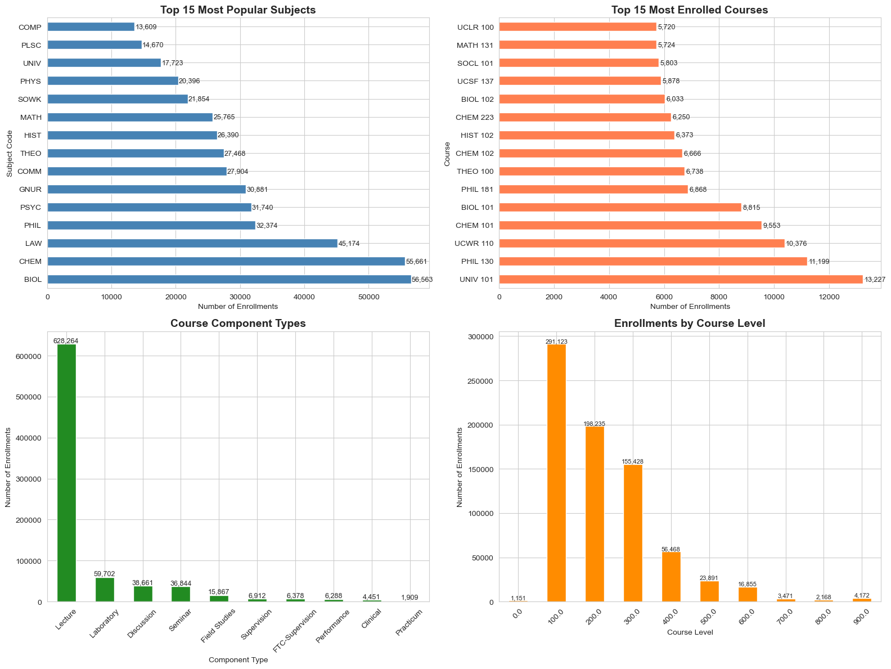
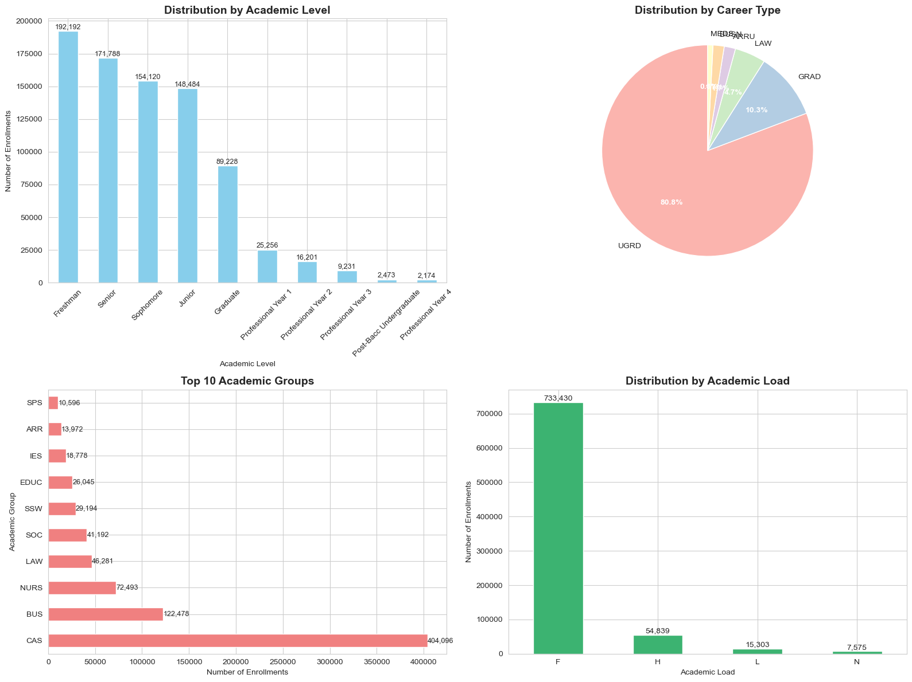
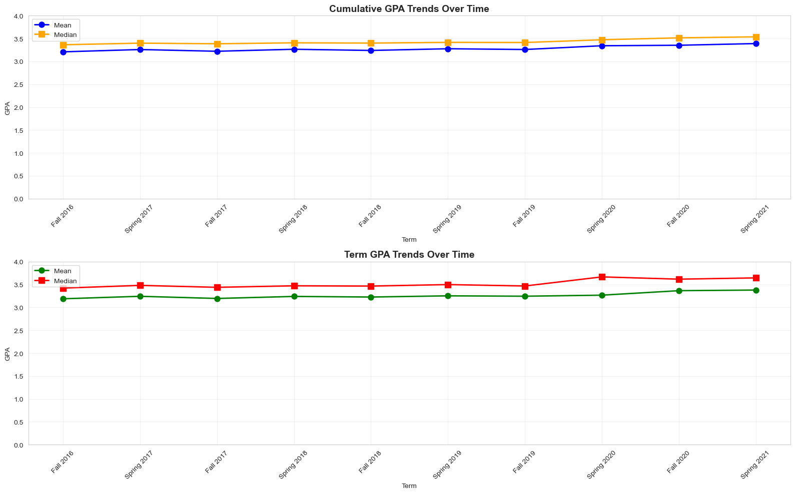
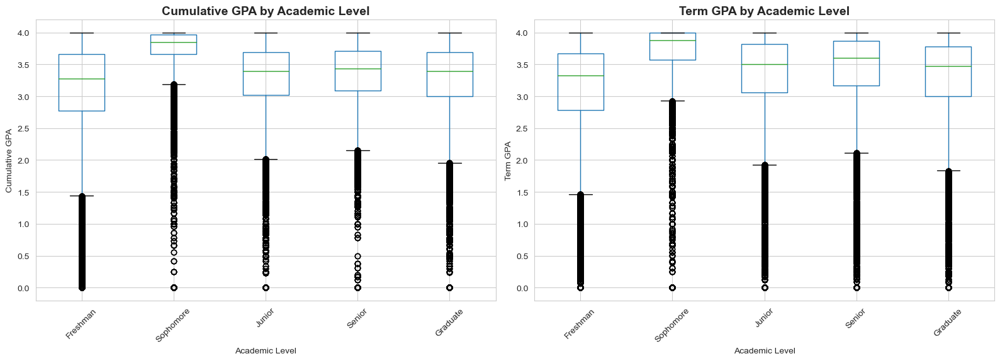

# Plan B Final Report

## Introduction

For many students entering university, choosing the degree that they are going to pursue is one of the most important decisions that they make during their college career. This choice determines what path they are set up for academically and whether they will be able to graduate in a timely manner while still maintaining a respectable GPA. However, many students consider switching their degree of study upon the realization that their current major does not align with their goals or interests. Students may pivot towards an alternative major that allows them to pursue a career post-graduation. However, one prominent issue with this is that this change of heart may come at the expense of taking more time to graduate than intended. This is why we chose to collaborate in building a project designed to help students change their major without having to add on multiple semesters of college tuition while still allowing them to study an area of interest. This project idea was initially inspired by Loyola students on the pre-health track (medicine, dentistry, optometry, etc.). As the project progressed, we decided it would be beneficial to expand our outlook on all students that desire to change their major. While pre-health students remained as an important use case, we had the intention of making our system widely applicable in all academic setting at Loyola University. In order to achieve this, we developed a recommendation system that is responsible for analyzing a given student's completed coursework within their major to predict the next most optimal majors that are worthy of switching to while still graduating on time. Overall, this system was integrated with filters to further personalize a student's academic goals with remaining courseload and time needed to graduate taken into account.

## Data Trends

The enrollment data is from Fall 2016 to Spring 2021 and has 811,147 course enrollments, 45,820 unique students, 74 columns including academic level, subject, course number, enrollment status, GPA, credit hours and more. Regarding trends, there was a heavy concentration in 100-level courses and Biology, Chemistry, Law, Philosophy, and Psychology were the most popular subjects.

In addition, more than 80% of students in the data are undergraduate students and the College of Arts and Sciences was the largest academic group with strong representation from Business, Nursing and Law.

Finally, the average GPA falls between 3.1 and 3.2 and the median falls between 3.4 and 3.5, depending on the academic year. GPA also tends to rise with academic level, where Freshmen have the lowest median GPA, while Sophomores through Seniors cluster higher.

## Methods

The major recommendation system that we designed combines student enrollment data with structured Loyola major requirements to generate a personalized suggestion built from 3 major components: data processing, recommendation logic, and a web interface. Deidentified student data was obtained between the years 2016-2021 to maintain anonymity. This data allowed us to identify completed courses among every student, based on passing grades and converted into a standardized format that consisted of subject and course number. This approach is what allowed us to directly compare completed courses with major requirements at Loyola. Major requirement data was gathered via web scraper that we tailored to scrape to extract each major's curriculum requirements derived from Loyola's academic catalog web page. These requisites were stored as structured JSON files that consisted of required courses, elective options, and selection rules. The root of our recommendation system was an algorithm built on rules that intertwines a student's completed courses with the requirements of their respective major. For each major at Loyola, the system calculates how many courses overlap between a student's transcript and the number of classes that their major requires. The system then uses this overlap to rank appropriate majors with the more applicable ones being with the highest overlap. This approach ensures that each recommendation is brought forward with the student's best interest taken into consideration. In order to enhance the usability of this system, we included multiple filters to allow users to streamline their desired results. These filters were factors such as adjusting courseload, whether the new major can be completed within 4 years, and whether the student is interested in studying outside of their current department/school. In our final development stages, we used both automatic and manual testing methods to verify the validity of our recommendation system. Automatic testing was integrated by including unit tests for individual components, along with following the full recommender pipeline, and conducting end-to-end tests for the web application. In addition, a manual test was conducted with the creation of synthetic student profiles to serve as a baseline of verifying accuracy of our design.

## **Results**

The final system that we designed successfully ranks the top 5 alternative majors for any undergraduate student at Loyola based on their coursework. The system excludes their current major and orders the alternatives by credits earned, with additional information such as the completion percentage and matched course lists. In addition, the filters: outside of department, outside of school, and 4 year feasibility, work as expected and filter out options according to each student's preferences and constraints. Regarding tests, all 98 automated tests were passed including the unit tests for individual components, the full recommender pipeline, and end-to-end tests. The manual validation using 30 synthetic student profiles and the 10 real test cases further confirmed the system's correctness. For example, a student majoring in Accounting who have completed 17 Accounting courses received Accounting and Analytics, Economics, Finance, and International Business as their top major recommendations. In that way, the system successfully identified similar business majors based on the strong accounting coursework. Furthermore, during the manual validation process, we found some bugs such as duplicate majors and case-sensitivity, but they were fixed. The final system was also positively received and endorsed by the main stakeholder of the project, Dr. Catherine Putonti, who provided positive feedback on the interface and filters of the final system.

## **Conclusion/Future Work**

The Plan B system we developed matches students' transcript data with major requirements and creates personalized major recommendations for Loyola students in a Flask web interface, which is accessible and user-friendly, helping students and advisors. The tool was tested and validated with multiple automated and manual tests evaluating different aspects. Regarding future work, the system will need to be integrated with the full LUC tech stack, currently LOCUS, to work as expected and match each student's coursework and credits. The catalog will also need to be updated regularly since changes can happen every year in major requirements and pre-requisites. In addition, for future work, the tool could also account for course sequencing, include minor and certificate requirements and weight recommendations based on each student's performance (GPA) in relevant subjects. Those additions could improve the quality of the recommendations and help students plan their next few semesters. Overall, the system we designed accomplishes the initial goal set forth - to help and support all students that desire to change their major.

## Appendix

Github Link: <https://github.com/thiagopicinini/Stat370-PlanB>
